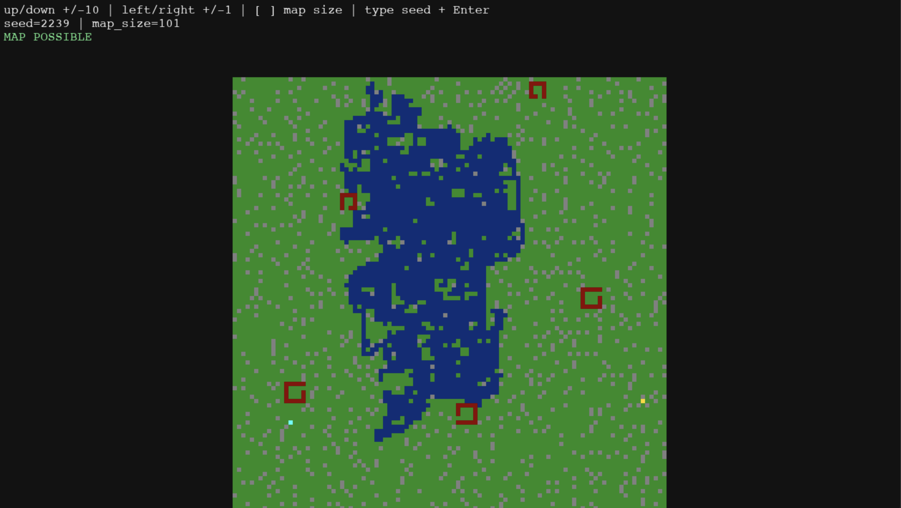

# Procedural Map Generator

A tile-based procedural map generator built from scratch in Python, using a custom pseudo-random number generator, BFS-based validation, and a probabilistic lake/river formation algorithm. Rendered with pygame.



---

## Features

- Deterministic map generation from a seed value
- Walls, multi-size buildings with entrances, and lakes/rivers
- BFS reachability check ensuring the treasure is always accessible
- Interactive pygame viewer: adjust seed and map size in real time

## Tile types

| Symbol | Tile     | Colour    |
| ------ | -------- | --------- |
| `g`    | Grass    | Green     |
| `w`    | Wall     | Grey      |
| `b`    | Building | Dark red  |
| `l`    | Lake     | Dark blue |
| `p`    | Player   | Cyan      |
| `t`    | Treasure | Gold      |

---

## Setup

**With uv (recommended)**

```bash
uv sync
uv run main.py
```

**With pip**

```bash
pip install pygame
python main.py
```

Requires Python 3.12+.

---

## Controls (pygame window)

| Key          | Action            |
| ------------ | ----------------- |
| Up / Down    | Seed ±10          |
| Left / Right | Seed ±1           |
| `[` / `]`    | Map size ±1       |
| Type + Enter | Set seed directly |

---

## How it works

### Pseudo-random number generator

All randomness derives from a **Mixed Linear Congruential Generator (LCG)**:

```
x_{n+1} = (a * x_n + c) mod m
```

with `a = 5`, `c = 1`, `m = 2^32`. These parameters satisfy the Hull-Dobell theorem, needed to create and LCG, also guaranteeing a full period - every possible value is visited before the sequence repeats. Modding by powers of 2 is deliberately avoided when interpreting output (`% 9` for walls, etc.) because low-order bits in an LCG have short periods and produce noticeably non-random patterns.

### Seed derivation per feature

A naive approach feeds the same LCG state into walls, buildings, and lakes sequentially. The problem: for a fixed map size, all three features advance through the sequence by the same number of steps every time, so the maps always look the same but everything is shifted a little - buildings and walls end up visually correlated across seeds.

The fix is to derive an independent starting seed for each feature class using a different multiplier and addend:

```python
wall_seed     = (seed * 6364136223846793005 + 1442695040888963407) & 0xFFFFFFFF
building_seed = (seed * 1103515245          + 12345 + map_size * 2654435761) & 0xFFFFFFFF
lake_seed     = (seed * 24597843            + 13497 + map_size * 3592078431) & 0xFFFFFFFF
```

Each multiplier is taken from well-known LCG parameter tables. Incorporating `map_size` into building and lake seeds also prevents the same object layout appearing at different grid sizes.

### Building placement

Buildings are hollow rectangles (4×4 to 6×6) with a single entrance tile. The entrance position is derived from `state % total_perimeter_excluding_corners`. Any pre-existing wall tiles inside the building footprint are replaced with grass, and the tile directly outside the entrance is also cleared to prevent the player being locked out by an adjacent wall.

Buildings are spaced using an Euclidean distance check against all previously placed buildings, requiring a gap of at least `map_size / 3`.

### Lake and river generation

Lakes are generated in four stages:

**1. Seed point selection** - a candidate point is chosen only from grass tiles that have a clear horizontal and vertical corridor of 30 tiles in each direction, preventing lakes from spawning adjacent to buildings or other lakes.

**2. Probabilistic flood fill** - starting from the seed point, tiles are added to the frontier with an 85% acceptance rate per neighbour. This produces an organic, irregular blob of 20–50 tiles rather than a square patch. Lakes only spawn on maps ≥ 40×40.

**3. Endpoint detection and closure** - after the initial fill, the two most geometrically distant lake tiles are found: a random tile is picked, its furthest neighbour in the set is found by Euclidean distance, then the furthest from _that_ point is found. This gives two reliable endpoints regardless of lake shape.

If the Euclidean distance between the endpoints is less than 65% of the total lake tile count, the lake is considered compact enough to close into a loop. A weighted path-tracer (`draw_pixel`) then walks from one endpoint to the other: each step has a 60% chance of filling a tile when that tile moves closer to the target, and a 40% chance otherwise. This produces a meandering, slightly irregular closure rather than a straight fill.

**4. Smoothing passes** - four iterations of a neighbour-count rule are applied: any grass tile adjacent to 3 or more lake tiles is converted to lake. Passes operate on a deep copy of the grid to avoid order-dependent artefacts. This rounds off sharp rectangular corners that the flood fill can leave behind.

### Map validation

`verify_map` runs after every generation and checks:

- Exactly one player and one treasure are present
- Every connected lake component contains ≥ 20 tiles (single-tile splinters from the smoothing pass are rejected)
- The treasure is reachable from the player via BFS over walkable tiles (`g`, `p`, `t`)
- The shortest path length is at least `⌈(2 × map_size) / 3⌉`, preventing trivially small maps from placing player and treasure next to each other

If the map fails validation the HUD shows the reason and a **Regenerate World** button repositions the player and treasure without rebuilding the full terrain.
